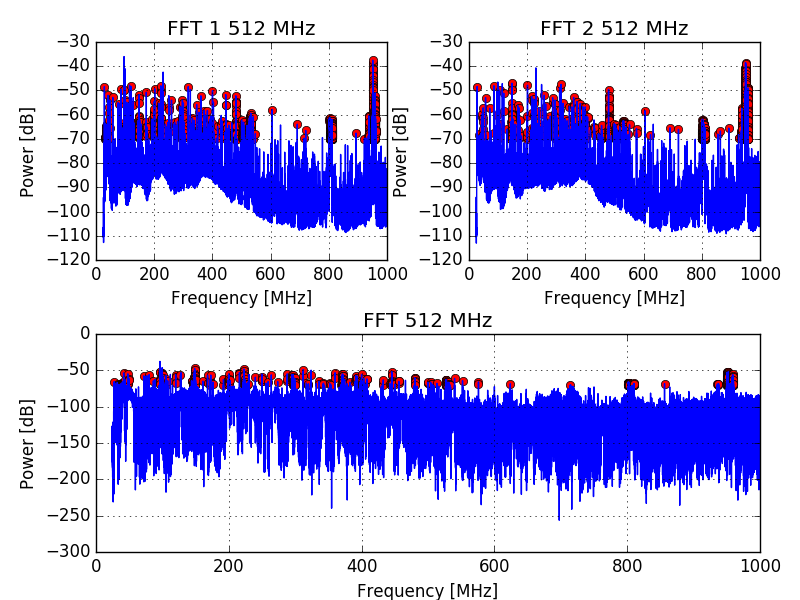

# Addi

### Spectrum



### Emissions

| f [MHz]   | P [dB]  |
|-----------|---------|
|111.95 MHz |-69 dB   |
|199.331 MHz|-81.15 dB|

### ASM code

```assembly
	.section .text
	.globl main

main: 
    add t0, zero, zero
1:  addi t0, t0, 1
    addi t0, t0, 1
    addi t0, t0, 1
    addi t0, t0, 1
    addi t0, t0, 1
    addi t0, t0, 1
    addi t0, t0, 1
    addi t0, t0, 1
    addi t0, t0, 1
    addi t0, t0, 1
    addi t0, t0, 1
    addi t0, t0, 1
    addi t0, t0, 1
    addi t0, t0, 1
    addi t0, t0, 1
    addi t0, t0, 1
    addi t0, t0, 1
    addi t0, t0, 1
    addi t0, t0, 1
    addi t0, t0, 1
    addi t0, t0, 1
    addi t0, t0, 1
    addi t0, t0, 1
    addi t0, t0, 1
    addi t0, t0, 1
    addi t0, t0, 1
    addi t0, t0, 1
    addi t0, t0, 1
    addi t0, t0, 1
    addi t0, t0, 1
    addi t0, t0, 1
    addi t0, t0, 1
    addi t0, t0, 1
    addi t0, t0, 1
    addi t0, t0, 1
    addi t0, t0, 1
    addi t0, t0, 1
    addi t0, t0, 1
    addi t0, t0, 1
    addi t0, t0, 1
    addi t0, t0, 1
    addi t0, t0, 1
    addi t0, t0, 1
    addi t0, t0, 1
    addi t0, t0, 1
    addi t0, t0, 1
    addi t0, t0, 1
    addi t0, t0, 1
    addi t0, t0, 1
    addi t0, t0, 1
    addi t0, t0, 1
    addi t0, t0, 1
    addi t0, t0, 1
    addi t0, t0, 1
    addi t0, t0, 1
    addi t0, t0, 1
    addi t0, t0, 1
    addi t0, t0, 1
    addi t0, t0, 1
    addi t0, t0, 1
    addi t0, t0, 1
    addi t0, t0, 1
    addi t0, t0, 1
    addi t0, t0, 1
    addi t0, t0, 1
    addi t0, t0, 1
    addi t0, t0, 1
    addi t0, t0, 1
    addi t0, t0, 1
    addi t0, t0, 1
    addi t0, t0, 1
    addi t0, t0, 1
    addi t0, t0, 1
    addi t0, t0, 1
    addi t0, t0, 1
    addi t0, t0, 1
    addi t0, t0, 1
    addi t0, t0, 1
    addi t0, t0, 1
    addi t0, t0, 1
    addi t0, t0, 1
    addi t0, t0, 1
    addi t0, t0, 1
    addi t0, t0, 1
    addi t0, t0, 1
    addi t0, t0, 1
    addi t0, t0, 1
    addi t0, t0, 1
    addi t0, t0, 1
    addi t0, t0, 1
    addi t0, t0, 1
    addi t0, t0, 1
    addi t0, t0, 1
    addi t0, t0, 1
    addi t0, t0, 1
    j 1b
```
