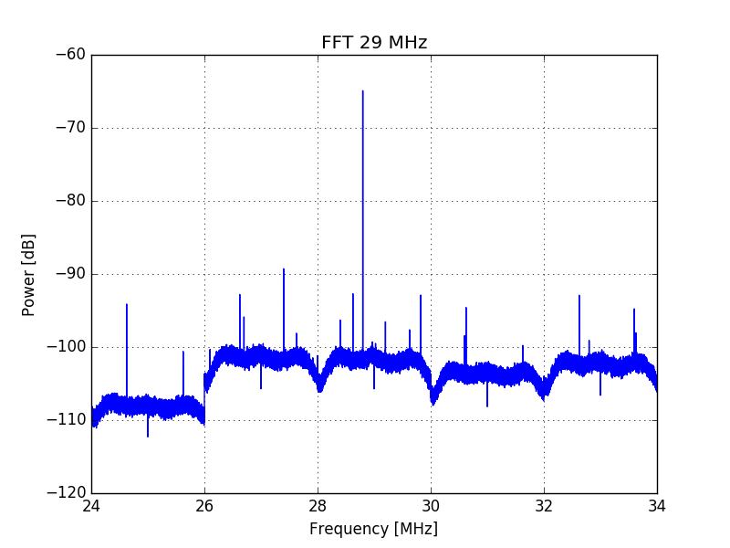

This page describes in detail how the realized Python scripts were developed and what could be done to improve them.

# td.py
The skeleton of this script has been obtained by exporting the Python code from a GNU radio .grc file. Then, the script was modified to be capable of dumping multiple frequency domain data from a defined range and to accept arguments from the commandline, in order to automatize the acquisition process. An attempt was also made in order to make the script capable of acquiring inside a certain frequency range while the board is active and while the board is inactive.

This would later allow to make the difference between the two acquisitions and extract only the carriers emitted by the board, canceling the effect of any background emission without the need of performing the tests inside e.g. an anechoic chamber. Unfortunately, due to the problems specified in the relative section, it is still necessary to make the two different acquisitions manually. The following sections will address the main issues and topics concerning this script.

### Source block
During the development of this project the RTL-SDR dongle was used, therefore the relative GNU Radio block was employed in order to use the RTL-SDR dongle as source. This block is not installed with GNU Radio: the [Setup](setup.md) section explains how to add it to the GNU Radio library. It is important to point out that, should another antenna be used, it would be very easy to adapt the script in order to use the corresponding GNU Radio source block. Thanks to GNU Radio flexibility and ease of use, the script can be easily adapted to support any other antenna supported by GNU Radio - and in general any device which can be operated through Python code. 

### Correction of 0 DC component
The Fourier transform of any signal acquired with the RTL-SDR has a spurious spike in the center of the spectrum. This is the infamous DC offset, a common issue when using direct conversion receivers such as the RTL-SDR dongle[^1]. In order to solve this problem I resorted to the GNU Radio [correctiq block](https://github.com/ghostop14/gr-correctiq), which can be inserted after the source block in order to remove this unwanted component. Notice that this block is not automatically installed with GNU Radio. The [Setup](setup.md) section explains how to install this block.

### Insertion of functions inside the GNU Radio class
The original Python class generated via the GNU Radio Companion was expanded in order to add the possibility of modifying the name of the raw data output file. This allows to easily recognize which frequencies are covered by the raw data file which is being generated.

### Issues with the Yepkit USB Switchable hub
Several lines were added in order to allow turning on and off the board under inspection. The idea was to automatize the acquisition of data inside a certain frequency range with and without the board, so that the difference between the two spectra could be computed later on and isolate only the carriers emitted by the board when executing a certain program. The [Yepkit USB Switchable Hub](https://www.yepkit.com/products/ykush), cheap and easy to operate, was employed for this purpose. Two main issues arised:
  1. When using this script with the `-d` option, which enables the usage of the Yepkit board, is necessary to start the script with sudo. There surely are ways to remove this need, but, due to lack of time, they were not explored;
  2. The HiFive1 board needs to be reloaded every time it is turned on;

The first issue was not solved, while the second one was bypassed by reloading every time the program under test after having restarted the HiFive1 board. The `-sn` option allows the user to choose the script to be re run each time the board is restarted. The example script provided in this repository simply uploads the program under test to the board.

### Restart of the GNU Radio source
While dumping time domain data the central frequency needs to be incremented at each iteration to acquire data coming from a different frequency range. In the meantime, the destination file needs to be updated in order to allow the `fp` script to read from the proper file when processing data related to a certain frequency range. In the initial development phase it has become evident that, without restarting the acquisition process, the only effect of changing the name of the destination file was to create a new file which the GNU Radio sink would not fill with data. Instead, all the data would be stored inside the first generated file.

In principle one might think to split the data coming from a single file in order to perform FFTs related to different frequency ranges. The issue is that, due to lack of determinism inherent to the instructions executed by an OS, the change in the center frequency occurs after a different interval of time. Hence, the amount of data relative to each frequency range varies. Due to this lack of determinism, it has been decided to the strategy of stopping and restarting the GNU Radio blocks at each change of frequency in order to generate a file for each frequency range.

It is important to notice that this adds a significant overhead to the acquisition time. Should it be possible to individuate exactly which bytes belong to which frequency range when dumping all the data to a single file, the adopted strategy should be discarded, as the script would greatly benefit in terms of timing performance.

### Step between acquisitions and sampling frequency
Only signals having a smaller frequency than the sampling frequency f<sub>s</sub> can be correctly represented after sampling[^2]. Translated to the frequency domain this means that, for each acquisition, the observable bandwidth corresponds to the sampling frequency. The program accepts as input parameters the starting and ending **center frequencies** of the range to be inspected, in MHz. Moreover, the default sampling frequency is equal to 2 MHz. If the program is launched with

   ```bash
   $ python td.py 26 30
   ```
The first acquisition will store data from 25 MHz to 27 MHz. Since data from 26 MHz to 27 MHz has already been acquired it is useless to start a new acquisition with center frequency 27 MHz, hence the new center frequency shall be equal to 28 MHz in order to acquire only data coming from a new frequency band. The second acquisition stores data from 27 MHz up until 29 MHz and the third acquisition stores data from 29 MHz to 31 MHz. Hence, the central frequency augments by the 2 MHz (the sampling frequency) between acquisitions, in order to avoid storing redundant data.

The current script doesn't support an adaptive step, i.e. this strategy will fail when the sampling frequency changes, as the bandwidth will either reduce or increase. Hence, augmenting the central frequency by 2 MHz at each time might be too much (frequency domain data is lost) or not enough (redundant data is stored). Future versions of this script should have the possibility to choose the step based on the sampling frequency, since it would make it much more flexible and since it should be very easy to do (this wasn't done in the current version due to lack of time).

### Sleep between acquisitions
The script includes several sleep instructions:
  * 2.5 seconds after having sent the commands to activate the Yepkit ports in order to give enough time to the board to begin executing the stored program before storing data. Notice however that, for the reasons explained in the previous section, this serves no purpose in the current script version;
  * 1 second before stopping the current acquisition, namely meaning that 1 second of data is stored for each frequency range;
  * 1 second after having sent the commands to deactivate the Yepkit ports, in order to give enough time to the board to power off before storing data;

All these delays were chosen rather arbitrarily and could be thought over in future versions of this script. A good idea could be, for instance, to give to the user the possibility to choose the acquisition time for each frequency range. 

# fp.py
This script processes the data stored inside raw byte files into power spectra in the frequency domain or into spectrograms. It can process a range of frequencies specified by the user and it may save the output to .npz files in order to load more quickly the processed data instead of having to process it anew each time.

The main usefulness of this script consists in being capable of, theoretically, isolating the frequencies emitted by a board executing some code against frequencies emitted by the background. However, several issues still remain to be solved or to be investigated in order to make the script more efficient.

### Loading complex data from raw binary files
Normally, the input comes from raw input byte files which contain an array of complex numbers. These arrays were generated using the `td.py` script, which allows to dump frequency domain information into several raw byte files. The convention used for these files is to have them using the .data extension and to append to their names, before the extension, the center frequency of the spectrum they refer to. Thanks to this, the `fp` script is capable of properly labeling and plotting a power spectrum when elaborating several input files. The `ldcomplex` function does all the "heavy lifting" and, in principle, doesn't have to be changed.

### Processing and central frequency step
Just like for the previous function, since the employed sampling frequency was always of 2 MHz, the step between each central frequency was of 2 MHz in order to process redundant data. The step, however, should be made adaptive in order to efficiently support also different sampling frequency. This was not done yet due to time constraints, however it is surely not difficult to implement.

### Power spectra with Welch's method
The main issue for this script was to find a proper way to subtract two spectra in order to highlight the difference between the two. As previously stated, this allows to subtract the common frequency components between an acquisition made when the board is executing a program and an acquisition when the board is off. This facility comes in very  handy as, if properly implemented, it may allow to achieve precious frequency information without necessarily having to employ an anechoic chamber.

The first issue is how to actually do the subtraction. The data of interest, as previously stated, is the frequency power spectral density, since it gives a first clear idea of which carriers are generated by a board executing a piece of code by inspecting the power emitted inside a certain frequency bin. Let's quickly remind some well known concepts of signal theory. The DFT transform of a discrete signal can obtained through the following formula:

```math
DFT(x)[k]=X[k]=\frac{1}{\sqrt{N}}\Sigma_{n=0}^{n=N-1}x[n]e^{-j \frac{2 \pi}{N}nk}
```

Notice that a Fourier transform can employ several normalizations. The one employed here is $`\frac{1}{\sqrt{N}}`$ for convenience, since the goal is to obtain the power spectrum. From here, the power spectrum is obtained by computing the magnitude square of the DFT:

```math
S_{xx}[k]=|X[k]|^2=\frac{1}{N}|\Sigma_{n=0}^{n=N-1}x[n]e^{-j \frac{2 \pi}{N}nk}|^2
```

whose dimension is $`\frac{V^2}{Hz}`$. Our goal is to eliminate from the power spectrum all the components which are not emanated by the board. Since the power spectral densities are generated from the DFT, the most practical way to do so seemed to subtract the magnitude of the DFT obtained without the board from the magnitude of the DFT obtained when using the board.

```math
S_{xx,diff}[k]=(\sqrt{S_{xx,b}}-\sqrt{S_{xx,nb}})^2=\frac{1}{N}(|\Sigma_{n=0}^{n=N-1}x_b[n]e^{-j \frac{2 \pi}{N}nk}|-|\Sigma_{n=0}^{n=N-1}x_{nb}[n]e^{-j \frac{2 \pi}{N}nk}|)^2
```

This way a new spectrum is obtained. This spectrum, in principle, contains only the frequencies emitted by the board since all the power spectral densities in common have been eliminated. However, the main issue of this procedure is that, due to the low cost nature of the employed equipment and of the noisy environments where the acquisitions take place, many spurious frequencies appear in both spectra, namely meaning that the SNR should be high enough to make sure that only the common frequencies are eliminated. If this is not true, random noise present in only one power spectrum will "survive" the subtraction and pollute the output data.

In order to increase the SNR the power spectra were computed using Welch's method[^3]. This algorithm is provided by the Scipy Python library and consists in averaging several FFTs to augment the SNR in spite of a resolution loss. The algorithm divides the time domain data into several segments, which may or may not overlap, and evaluates the power spectrum for each of them. Then, the various power spectrum are added together and averaged. The overlap, if present, adds redundant data. The weight of this redundant data is diminished by applying a non rectangular window to the time domain data. The following picture shows the windows usually employed for this purpose.


The most popular and most versatile window, when it comes to Welch's method, is the Hanning window, and is hence the one which has been used. The aforementioned resolution loss is due to the application of a non rectangular window and to the splitting of time domain data into smaller segments. In this framework, however, the resulting frequency resolution loss seemed acceptable, since in any case the time domain data for each recorded frequency range was large: a 1 s trace was was sampled at 2 MHz for each frequency range, therefore the number of samples for each frequency range amounted to 2x10^6.

It was noticed that frequency emissions at the borders of the window could still be noticed, if reasonably high. In case the reader is skeptical, in any case, this issue can be completely bypassed by performing two analysis of the overall data, with the second analysis selecting as starting and ending frequency the previously chosen values plus half of the sampling frequency. In this way the frequencies which previously occupied the border of a Hamming window will occupy the center, hence guaranteeing that any emission in that range can be properly observed. The following two pictures should clarify what has clumsily been explained in the previous lines.


In spite of all these arguments, however, the sampling frequency or the acquisition time might vary in a different framework, hence this method might result not convenient any longer in such an occurrence, or, perhaps, the parameters used in this version will have to be varied.

Back to the current implementation, after several tests, which were all but exhaustive, an optimum was found in using 16383 samples to compute each power spectrum with an overlap between segments of $`\frac{16383}{2}`$=8191 samples. The following pictures show the obtained power spectrum when using the adopted overlap size and no overlap at all (which is equivalent to using Bartlett's method[^4]).




The noise variance and magnitude is clearly reduced when adopting the aforementioned overlap. The FFT length was kept identical to the length of each segment, since a zero padded FFT served no purpose in the current framework. The detrend parameter was left to its original value, in order to remove the average of the input data and hence avoid the appearance of the unwanted 0 DC component. Lastly, the scaling parameter was left to 'density' in order to obtain the power spectral density.

The following picture shows the output plot when performing the difference between the spectra of two sets of data between 80 and 86 MHz.


The result seems quite good, since the common frequencies have clearly been canceled. Only small peaks remain, which might or might not be related to electromagnetic emissions coming from the board. Since their magnitude is quite small the likelihood is low. However, the only way to make sure is to inspect this frequencies in real time and see if those carriers appear when putting the board close to the antenna.

This section represents most likely the most critical part in all the developed work and, therefore, should be questioned in every aspect. The `welch` function should be tested with different parameters in order to figure out which are the most suited for the current case. Remember, lastly, that in order to perform the difference between samples the `-d` option must be specified and that two different .dat files need to have been acquired for each targeted central frequency. The default names of these files are test<n>.dat and bg<n>.dat, where n is the central frequency in MHz. The central frequency and the extension are necessary components, however the filenames may be specified through the commandline when launching the script.

### The peak detection function
As previously stated, the [detect_peaks](https://github.com/demotu/BMC) function realized by Marcos Duarte was employed in order to inspect the produced power spectra and individuate peaks in the power spectra. Obviously, peaks are of particular interest because they may correspond to carriers emitted by the board. The strength of the `detect_peaks` function lies in the fact that it can be customized in order to perform the optimal search.

Again, due to time constraints, this function was not explored as it should have been. In the current version of this script, the `mph` parameter, which lets choose the minimum peak magnitude, was left to be chosen by the user (with a default value of -90 db). The `mpd` parameter, which defines the minimum distance between peaks, after several tests, was set to the arbitrary value of 1400. Moreover, the `kpsh` parameter was set to true in order to keep peaks closer than `mpd` if they have the same magnitude. All these parameters, as well as the other ones, should be experimented upon in order to taylor the peak detection procedure to the current case.

In order to facilitate the peak detection process, the `-e` option can be used in conjunction with the `-P` to export the found peaks inside a .txt file, where the peak magnitudes will be written next to the relative frequency. If the `-d` option is specified three output files will be produced, since three different spectra are output. Notice that the default name for these files are respectively "scan", "scan1" (acquisition with board) and "scan2" (background frequencies). These filenames can be changed when launching the script by passing the appropriate parameters via the commandline. The suffix of the filename is the current date and time, in order to avoid overwriting previously exported peak data, plus the .txt extension.

### Showing the spectrogram
The `spectrogram` facility granted by the Scipy library was used to produce step by step and aggregate spectrograms of several frequency ranges. It is possible to compute a differential spectrogram as well by specifying both the `-g` and the `-d` options. However, the result, for the time being, doesn't seem to be very useful, as the differential spectrogram is usually too noisy to be useful. Notice that the main use of the spectrogram is to be able to to observe how the frequency emissions changed over time, and hence inspect more thoroughly the activity of the board with respect to the averaged power spectra. The latter ones are good to give an idea on the frequencies which should be inspected but they can't convey much information besides that.

### Saving processed data in compressed format
Processing data to compute power spectra or spectrograms takes a long amount of time, hence the script provides the possibility to save the currently processed data into compressed .npz files which can be later opened to simply plot the data stored within. Notice that when doing so the step by step visualization is not possible. Also notice that when you do that providing the minimum and the maximum central frequencies serves no purpose, as these data are embedded in the .npz files. In fact, the script should be modified so that it won't request these frequencies if the `-o` parameter is specified.

[^1]: R. Svitek and S. Raman, "DC offsets in direct-conversion receivers: characterization and implications," in IEEE Microwave Magazine, vol. 6, no. 3, pp. 76-86, Sept. 2005. doi: [10.1109/MMW.2005.1511916](https://doi.org/10.1109/MMW.2005.1511916)

[^2]: This is the famous Nyquist-Shannon sampling theorem. The following reference was added just for the sake of completeness, as the theorem needs no introduction: Shannon, Claude E. (January 1949). "Communication in the presence of noise". Proceedings of the Institute of Radio Engineers. 37 (1): 10–21. doi: [10.1109/jrproc.1949.232969](https://ieeexplore.ieee.org/document/1697831/)

[^3]: P. Welch, “The use of the fast Fourier transform for the estimation of power spectra: A method based on time averaging over short, modified periodograms”, IEEE Trans. Audio Electroacoust. vol. 15, pp. 70-73, 1967

[^4]: Bartlett, M.S. (1948). "Smoothing Periodograms from Time-Series with Continuous Spectra". Nature. 161: 686–687. doi:[10.1038/161686a0](https://doi.org/10.1038%2F161686a0)
